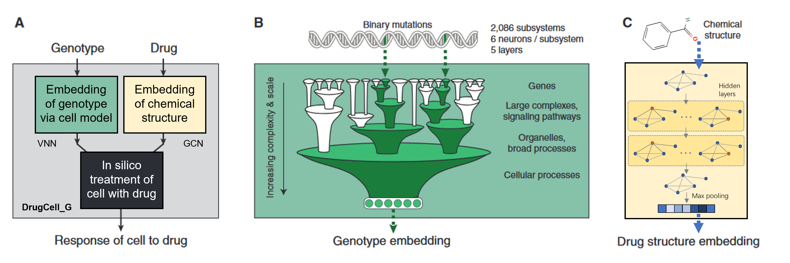
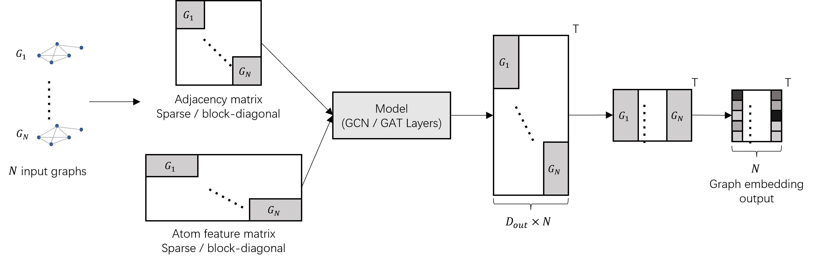

<!--
 * @Date: 2022-04-30 16:20:28
 * @LastEditors: yuhhong
 * @LastEditTime: 2022-05-04 19:51:58
-->
# I529 - Experiments on DrugCell




This is the final project of I-529. We did the following experiments based on DrugCell:

- Using unhashed fingerprints of drugs;
- Using Graph Convolution Network (GCN) to embed drugs.  

To train a GCN/GAT in batchwise, we build up the model parallelly shown in following figure, referring this [issue](https://github.com/tkipf/gcn/issues/4). 



The results are: 

| Model                                            | Test Pearson Corr | Scripts                                            |
|--------------------------------------------------|-------------------|----------------------------------------------------|
| Pretrained model                                 | 0.822805          | `test_pretrain.sh`                                 |
| Train on `drugcell_all.txt`                      | 0.808271          | `ours_train.sh` & `ours_test.sh`                   |
| Train on `drugcell_all.txt` & using unhashed FP  | 0.807748          | `ours_train_unhash.sh` & `ours_test_unhash.sh`     |
| Train on `drugcell_train.txt`                    | 0.445488          | `commandline_train.sh` & `commandline_test_gpu.sh` |
| Train on `drugcell_train.txt` & drug graph       | 0.234693          | `ours_train_graph.sh` & `ours_test_graph.sh`       |


## Dataset

```bash
$ cat drugcell_all.txt | wc -l
509294
$ cat drugcell_train.txt | wc -l
10000
$ cat drugcell_test.txt | wc -l
1000
```


## Experiments

The pretrained model and whole dataset can be download [here](http://drugcell.ucsd.edu/downloads). Please set up the environment as described in `./DrugCell_README.md`. Then install `rdkit` for loading drug graph and `tqdm` for showing the process bar by following command:  

```bash
conda install -c rdkit rdkit
conda install -c conda-forge tqdm
```

Here are the experiment scripts: 

```bash
conda activate pytorch3drugcell

# 1. test the pretrained model
./test_pretrain.sh

# 2. train our own model
./ours_train.sh

# other exp
./ours_train_unhash.sh
./ours_train_graph.sh

# 3. test our own model
./ours_test.sh
```


## Reference

```bib
@article{kuenzi2020predicting,
  title={Predicting drug response and synergy using a deep learning model of human cancer cells},
  author={Kuenzi, Brent M and Park, Jisoo and Fong, Samson H and Sanchez, Kyle S and Lee, John and Kreisberg, Jason F and Ma, Jianzhu and Ideker, Trey},
  journal={Cancer cell},
  volume={38},
  number={5},
  pages={672--684},
  year={2020},
  publisher={Elsevier}
}
```